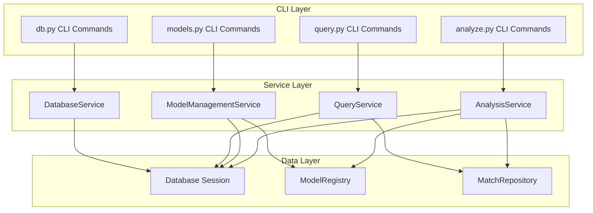

# Phase 3: Service Layer Architecture Design

## Executive Summary

This document defines the architecture for extracting business logic from CLI commands into a dedicated service layer. The goal is to achieve:

- **Separation of Concerns**: CLI commands handle only presentation, services handle business logic
- **Testability**: Services can be unit tested independently of CLI
- **Reusability**: Services can be used by both CLI and API layers
- **Consistency**: Uniform patterns for error handling, logging, and data access

## Current State Analysis

### Existing CLI Commands

| File | Commands | Business Logic Present |
|------|----------|------------------------|
| [`db.py`](algobet/cli/commands/db.py) | `init`, `reset`, `stats` | Database initialization, statistics queries |
| [`query.py`](algobet/cli/commands/query.py) | `tournaments`, `teams`, `upcoming` | Filtering, counting matches per team |
| [`models.py`](algobet/cli/commands/models.py) | `delete`, `list` | Model file deletion, registry queries |
| [`analyze.py`](algobet/cli/commands/analyze.py) | `backtest`, `value-bets`, `calibrate` | Feature generation, prediction, evaluation |

### Existing Services

| File | Purpose | Pattern |
|------|---------|---------|
| [`base.py`](algobet/services/base.py) | Base class with session management | `BaseService[T]` with session injection |
| [`prediction_service.py`](algobet/services/prediction_service.py) | Match predictions | Uses `ModelRegistry`, `MatchRepository`, `FormCalculator` |
| [`scraping_service.py`](algobet/services/scraping_service.py) | Scraping orchestration | Uses progress callbacks, in-memory job storage |
| [`scheduler_service.py`](algobet/services/scheduler_service.py) | Background task scheduling | Uses APScheduler integration |

### Key Patterns to Follow

1. **Session Injection**: Services receive `Session` in constructor
2. **Repository Usage**: Services use repositories for data access (e.g., `MatchRepository`)
3. **Dataclass DTOs**: Services return dataclass objects, not ORM models
4. **Exception Raising**: Services raise domain exceptions from [`exceptions.py`](algobet/exceptions.py)

---

## Service Layer Design

### Architecture Overview



---

## 1. DatabaseService Design

### Purpose
Extract database management operations from [`db.py`](algobet/cli/commands/db.py).

### Location
`algobet/services/database_service.py`

### Dependencies
- `sqlalchemy.orm.Session`
- `algobet.config.AlgobetConfig`
- `algobet.logging_config.Logger`

### DTOs

```python
from dataclasses import dataclass
from datetime import datetime

@dataclass(frozen=True)
class DatabaseStats:
    """Database statistics response."""
    tournament_count: int
    season_count: int
    team_count: int
    match_count: int
    prediction_count: int
    model_version_count: int
    collected_at: datetime

@dataclass(frozen=True)
class InitializationResult:
    """Result of database initialization."""
    success: bool
    tables_created: list[str]
    duration_ms: float
    error_message: str | None = None
```

### Service Interface

```python
from typing import Protocol

class DatabaseServiceProtocol(Protocol):
    """Protocol defining DatabaseService interface."""

    def get_statistics(self) -> DatabaseStats:
        """Retrieve database statistics.

        Returns:
            DatabaseStats with current record counts.

        Raises:
            DatabaseConnectionError: If database is unreachable.
            DatabaseQueryError: If statistics query fails.
        """
        ...

    def initialize_database(self) -> InitializationResult:
        """Initialize database with all tables.

        Creates all tables defined in the SQLAlchemy metadata.
        Safe to call on existing databases (no-op for existing tables).

        Returns:
            InitializationResult with created tables.

        Raises:
            DatabaseConnectionError: If database is unreachable.
        """
        ...

    def reset_database(self, *, confirm: bool = False) -> InitializationResult:
        """Reset database by dropping and recreating all tables.

        WARNING: This destroys all data. Must be explicitly confirmed.

        Args:
            confirm: Must be True to proceed with reset.

        Returns:
            InitializationResult with created tables.

        Raises:
            DatabaseConnectionError: If database is unreachable.
            DatabaseError: If reset fails.
            ValueError: If confirm is False.
        """
        ...
```

### Implementation

```python
from __future__ import annotations

import time
from typing import Any

from sqlalchemy import func
from sqlalchemy.orm import Session

from algobet.config import AlgobetConfig
from algobet.exceptions import DatabaseConnectionError, DatabaseQueryError, DatabaseError
from algobet.logging_config import get_logger
from algobet.models import Base, Match, ModelVersion, Prediction, Season, Team, Tournament
from algobet.services.base import BaseService
from algobet.services.dto import DatabaseStats, InitializationResult


class DatabaseService(BaseService[Any]):
    """Service for database management operations."""

    def __init__(
        self,
        session: Session,
        config: AlgobetConfig | None = None,
    ) -> None:
        super().__init__(session)
        self.config = config or get_config()
        self.logger = get_logger("services.database")

    def get_statistics(self) -> DatabaseStats:
        """Retrieve database statistics."""
        self.logger.debug("Retrieving database statistics")

        try:
            stats = DatabaseStats(
                tournament_count=self._count(Tournament),
                season_count=self._count(Season),
                team_count=self._count(Team),
                match_count=self._count(Match),
                prediction_count=self._count(Prediction),
                model_version_count=self._count(ModelVersion),
                collected_at=datetime.now(),
            )
            self.logger.info(
                "Database statistics retrieved",
                extra={"match_count": stats.match_count}
            )
            return stats
        except Exception as e:
            self.logger.error(f"Failed to retrieve statistics: {e}")
            raise DatabaseQueryError(
                f"Failed to retrieve database statistics: {e}",
                details={"error_type": type(e).__name__},
            ) from e

    def _count(self, model_class: type) -> int:
        """Count records in a table."""
        return self.session.query(func.count(model_class.id)).scalar() or 0

    def initialize_database(self) -> InitializationResult:
        """Initialize database with all tables."""
        self.logger.info("Initializing database")
        start_time = time.perf_counter()

        try:
            from algobet.database import create_db_engine

            engine = create_db_engine()
            tables_before = set(engine.table_names())
            Base.metadata.create_all(bind=engine)
            tables_after = set(engine.table_names())

            created_tables = list(tables_after - tables_before)
            duration_ms = (time.perf_counter() - start_time) * 1000

            self.logger.success(
                "Database initialized",
                extra={"tables_created": len(created_tables), "duration_ms": duration_ms}
            )

            return InitializationResult(
                success=True,
                tables_created=created_tables,
                duration_ms=duration_ms,
            )
        except Exception as e:
            duration_ms = (time.perf_counter() - start_time) * 1000
            self.logger.error(f"Database initialization failed: {e}")
            raise DatabaseConnectionError(
                f"Failed to initialize database: {e}",
                details={"error_type": type(e).__name__},
            ) from e

    def reset_database(self, *, confirm: bool = False) -> InitializationResult:
        """Reset database by dropping and recreating all tables."""
        if not confirm:
            raise ValueError("Database reset requires confirm=True")

        self.logger.warning("Resetting database - all data will be lost")
        start_time = time.perf_counter()

        try:
            from algobet.database import create_db_engine

            engine = create_db_engine()
            Base.metadata.drop_all(bind=engine)
            Base.metadata.create_all(bind=engine)

            duration_ms = (time.perf_counter() - start_time) * 1000
            tables = list(engine.table_names())

            self.logger.success(
                "Database reset complete",
                extra={"tables_created": len(tables), "duration_ms": duration_ms}
            )

            return InitializationResult(
                success=True,
                tables_created=tables,
                duration_ms=duration_ms,
            )
        except Exception as e:
            self.logger.error(f"Database reset failed: {e}")
            raise DatabaseError(
                f"Failed to reset database: {e}",
                details={"error_type": type(e).__name__},
            ) from e
```

---

## 2. QueryService Design

### Purpose
Extract query/list operations from [`query.py`](algobet/cli/commands/query.py).

### Location
`algobet/services/query_service.py`

### Dependencies
- `sqlalchemy.orm.Session`
- `algobet.predictions.data.queries.MatchRepository`

### DTOs

```python
from dataclasses import dataclass
from datetime import datetime

@dataclass(frozen=True)
class TournamentInfo:
    """Tournament information."""
    id: int
    name: str
    country: str
    url_slug: str
    seasons: list[str]

@dataclass(frozen=True)
class TeamInfo:
    """Team information with match counts."""
    id: int
    name: str
    home_match_count: int
    away_match_count: int
    total_match_count: int

@dataclass(frozen=True)
class UpcomingMatchInfo:
    """Upcoming match information."""
    id: int
    match_date: datetime
    home_team: str
    away_team: str
    tournament: str | None
    odds_home: float | None
    odds_draw: float | None
    odds_away: float | None

@dataclass(frozen=True)
class TournamentFilter:
    """Filter criteria for tournaments."""
    name_contains: str | None = None

@dataclass(frozen=True)
class TeamFilter:
    """Filter criteria for teams."""
    name_contains: str | None = None

@dataclass(frozen=True)
class UpcomingMatchFilter:
    """Filter criteria for upcoming matches."""
    days_ahead: int = 7
```

### Service Interface

```python
class QueryServiceProtocol(Protocol):
    """Protocol defining QueryService interface."""

    def list_tournaments(
        self,
        filter: TournamentFilter | None = None
    ) -> list[TournamentInfo]:
        """List tournaments with optional filtering.

        Args:
            filter: Optional filter criteria.

        Returns:
            List of TournamentInfo objects.

        Raises:
            DataNotFoundError: If no tournaments match criteria.
            DatabaseQueryError: If query fails.
        """
        ...

    def list_teams(
        self,
        filter: TeamFilter | None = None
    ) -> list[TeamInfo]:
        """List teams with optional filtering.

        Args:
            filter: Optional filter criteria.

        Returns:
            List of TeamInfo objects with match counts.

        Raises:
            DataNotFoundError: If no teams match criteria.
            DatabaseQueryError: If query fails.
        """
        ...

    def list_upcoming_matches(
        self,
        filter: UpcomingMatchFilter | None = None
    ) -> list[UpcomingMatchInfo]:
        """List upcoming matches within date range.

        Args:
            filter: Optional filter with days_ahead.

        Returns:
            List of UpcomingMatchInfo objects.

        Raises:
            DataNotFoundError: If no upcoming matches found.
            DatabaseQueryError: If query fails.
        """
        ...
```

### Implementation

```python
from __future__ import annotations

from datetime import datetime, timedelta
from typing import Any

from sqlalchemy import func
from sqlalchemy.orm import Session

from algobet.exceptions import DataNotFoundError, DatabaseQueryError
from algobet.logging_config import get_logger
from algobet.models import Match, Team, Tournament
from algobet.services.base import BaseService
from algobet.services.dto import (
    TeamFilter,
    TeamInfo,
    TournamentFilter,
    TournamentInfo,
    UpcomingMatchFilter,
    UpcomingMatchInfo,
)


class QueryService(BaseService[Any]):
    """Service for querying and listing data."""

    def __init__(self, session: Session) -> None:
        super().__init__(session)
        self.logger = get_logger("services.query")

    def list_tournaments(
        self,
        filter: TournamentFilter | None = None
    ) -> list[TournamentInfo]:
        """List tournaments with optional filtering."""
        self.logger.debug("Listing tournaments", extra={"filter": str(filter)})

        try:
            query = self.session.query(Tournament)

            if filter and filter.name_contains:
                query = query.filter(
                    Tournament.name.ilike(f"%{filter.name_contains}%")
                )

            tournaments = query.order_by(Tournament.country, Tournament.name).all()

            if not tournaments:
                raise DataNotFoundError(
                    "No tournaments found.",
                    details={"filter": filter.name_contains if filter else None},
                )

            result = [
                TournamentInfo(
                    id=t.id,
                    name=t.name,
                    country=t.country,
                    url_slug=t.url_slug,
                    seasons=[s.name for s in t.seasons],
                )
                for t in tournaments
            ]

            self.logger.info(
                "Tournaments listed",
                extra={"count": len(result)}
            )
            return result

        except DataNotFoundError:
            raise
        except Exception as e:
            self.logger.error(f"Failed to list tournaments: {e}")
            raise DatabaseQueryError(
                f"Failed to list tournaments: {e}",
                details={"error_type": type(e).__name__},
            ) from e

    def list_teams(
        self,
        filter: TeamFilter | None = None
    ) -> list[TeamInfo]:
        """List teams with optional filtering."""
        self.logger.debug("Listing teams", extra={"filter": str(filter)})

        try:
            query = self.session.query(Team)

            if filter and filter.name_contains:
                query = query.filter(Team.name.ilike(f"%{filter.name_contains}%"))

            teams = query.order_by(Team.name).all()

            if not teams:
                raise DataNotFoundError(
                    "No teams found.",
                    details={"filter": filter.name_contains if filter else None},
                )

            result = [
                TeamInfo(
                    id=t.id,
                    name=t.name,
                    home_match_count=self._count_matches(t.id, is_home=True),
                    away_match_count=self._count_matches(t.id, is_home=False),
                    total_match_count=self._count_matches(t.id),
                )
                for t in teams
            ]

            self.logger.info("Teams listed", extra={"count": len(result)})
            return result

        except DataNotFoundError:
            raise
        except Exception as e:
            self.logger.error(f"Failed to list teams: {e}")
            raise DatabaseQueryError(
                f"Failed to list teams: {e}",
                details={"error_type": type(e).__name__},
            ) from e

    def _count_matches(
        self,
        team_id: int,
        is_home: bool | None = None
    ) -> int:
        """Count matches for a team."""
        query = self.session.query(func.count(Match.id))

        if is_home is None:
            # Total matches
            query = query.filter(
                (Match.home_team_id == team_id) | (Match.away_team_id == team_id)
            )
        elif is_home:
            query = query.filter(Match.home_team_id == team_id)
        else:
            query = query.filter(Match.away_team_id == team_id)

        return query.scalar() or 0

    def list_upcoming_matches(
        self,
        filter: UpcomingMatchFilter | None = None
    ) -> list[UpcomingMatchInfo]:
        """List upcoming matches within date range."""
        days = filter.days_ahead if filter else 7
        self.logger.debug("Listing upcoming matches", extra={"days": days})

        try:
            max_date = datetime.now() + timedelta(days=days)
            matches = (
                self.session.query(Match)
                .filter(Match.status == "SCHEDULED")
                .filter(Match.match_date <= max_date)
                .order_by(Match.match_date)
                .all()
            )

            if not matches:
                raise DataNotFoundError(
                    f"No upcoming matches in the next {days} days.",
                    details={"days": days},
                )

            result = [
                UpcomingMatchInfo(
                    id=m.id,
                    match_date=m.match_date,
                    home_team=m.home_team.name,
                    away_team=m.away_team.name,
                    tournament=m.tournament.name if m.tournament else None,
                    odds_home=m.odds_home,
                    odds_draw=m.odds_draw,
                    odds_away=m.odds_away,
                )
                for m in matches
            ]

            self.logger.info(
                "Upcoming matches listed",
                extra={"count": len(result), "days": days}
            )
            return result

        except DataNotFoundError:
            raise
        except Exception as e:
            self.logger.error(f"Failed to list upcoming matches: {e}")
            raise DatabaseQueryError(
                f"Failed to list upcoming matches: {e}",
                details={"error_type": type(e).__name__, "days": days},
            ) from e
```

---

## 3. ModelManagementService Design

### Purpose
Extract model management operations from [`models.py`](algobet/cli/commands/models.py).

### Location
`algobet/services/model_management_service.py`

### Dependencies
- `sqlalchemy.orm.Session`
- `algobet.predictions.models.registry.ModelRegistry`
- `pathlib.Path`

### DTOs

```python
from dataclasses import dataclass
from datetime import datetime
from pathlib import Path

@dataclass(frozen=True)
class ModelInfo:
    """Model version information."""
    id: int
    version: str
    model_type: str
    created_at: datetime
    is_production: bool
    metrics: dict[str, float]
    description: str | None
    artifact_path: Path | None

@dataclass(frozen=True)
class ModelDeletionResult:
    """Result of model deletion."""
    success: bool
    version: str
    artifact_deleted: bool
    database_record_deleted: bool
```

### Service Interface

```python
class ModelManagementServiceProtocol(Protocol):
    """Protocol defining ModelManagementService interface."""

    def list_models(self) -> list[ModelInfo]:
        """List all registered model versions.

        Returns:
            List of ModelInfo objects.

        Raises:
            ModelNotFoundError: If no models are registered.
            ModelLoadError: If registry access fails.
        """
        ...

    def get_model(self, model_id: int) -> ModelInfo:
        """Get specific model by ID.

        Args:
            model_id: Database ID of the model.

        Returns:
            ModelInfo for the requested model.

        Raises:
            ModelNotFoundError: If model ID does not exist.
        """
        ...

    def delete_model(self, model_id: int) -> ModelDeletionResult:
        """Delete a model version.

        Removes both the database record and the artifact file.

        Args:
            model_id: Database ID of the model to delete.

        Returns:
            ModelDeletionResult with deletion status.

        Raises:
            ModelNotFoundError: If model ID does not exist.
            ModelLoadError: If deletion fails.
        """
        ...

    def activate_model(self, model_id: int) -> ModelInfo:
        """Set a model as the production/active model.

        Args:
            model_id: Database ID of the model to activate.

        Returns:
            ModelInfo for the activated model.

        Raises:
            ModelNotFoundError: If model ID does not exist.
        """
        ...
```

### Implementation

```python
from __future__ import annotations

from pathlib import Path
from typing import Any

from sqlalchemy.orm import Session

from algobet.config import get_config
from algobet.exceptions import ModelNotFoundError, ModelLoadError
from algobet.logging_config import get_logger
from algobet.models import ModelVersion
from algobet.predictions.models.registry import ModelRegistry
from algobet.services.base import BaseService
from algobet.services.dto import ModelDeletionResult, ModelInfo


class ModelManagementService(BaseService[Any]):
    """Service for managing ML model versions."""

    def __init__(
        self,
        session: Session,
        models_path: Path | None = None,
    ) -> None:
        super().__init__(session)
        self.models_path = models_path or get_config().models.path
        self.registry = ModelRegistry(
            storage_path=self.models_path,
            session=session
        )
        self.logger = get_logger("services.model_management")

    def list_models(self) -> list[ModelInfo]:
        """List all registered model versions."""
        self.logger.debug("Listing models")

        try:
            models = list(self.registry.list_models())

            if not models:
                raise ModelNotFoundError("No models found.")

            result = [
                ModelInfo(
                    id=m.model_id,
                    version=m.version,
                    model_type=m.model_type,
                    created_at=m.created_at,
                    is_production=m.is_production,
                    metrics=m.metrics,
                    description=m.description,
                    artifact_path=m.artifact_path,
                )
                for m in models
            ]

            self.logger.info("Models listed", extra={"count": len(result)})
            return result

        except ModelNotFoundError:
            raise
        except Exception as e:
            self.logger.error(f"Failed to list models: {e}")
            raise ModelLoadError(
                f"Failed to list models: {e}",
                details={"error_type": type(e).__name__},
            ) from e

    def get_model(self, model_id: int) -> ModelInfo:
        """Get specific model by ID."""
        self.logger.debug("Getting model", extra={"model_id": model_id})

        model = (
            self.session.query(ModelVersion)
            .filter(ModelVersion.id == model_id)
            .first()
        )

        if not model:
            raise ModelNotFoundError(
                f"Model version with ID {model_id} not found.",
                details={"model_id": model_id},
            )

        return ModelInfo(
            id=model.id,
            version=model.version,
            model_type=model.model_type,
            created_at=model.created_at,
            is_production=model.is_production,
            metrics=model.metrics or {},
            description=model.description,
            artifact_path=self.models_path / f"{model.version}.pkl",
        )

    def delete_model(self, model_id: int) -> ModelDeletionResult:
        """Delete a model version."""
        self.logger.info("Deleting model", extra={"model_id": model_id})

        try:
            model = self.get_model(model_id)

            # Delete artifact file
            artifact_deleted = False
            model_file = self.models_path / f"{model.version}.pkl"
            if model_file.exists():
                model_file.unlink()
                artifact_deleted = True
                self.logger.debug(
                    "Model artifact deleted",
                    extra={"path": str(model_file)}
                )

            # Delete database record
            db_model = (
                self.session.query(ModelVersion)
                .filter(ModelVersion.id == model_id)
                .first()
            )
            if db_model:
                self.session.delete(db_model)
                self.session.flush()

            self.logger.success(
                "Model deleted",
                extra={"version": model.version}
            )

            return ModelDeletionResult(
                success=True,
                version=model.version,
                artifact_deleted=artifact_deleted,
                database_record_deleted=True,
            )

        except ModelNotFoundError:
            raise
        except Exception as e:
            self.logger.error(f"Failed to delete model: {e}")
            raise ModelLoadError(
                f"Failed to delete model: {e}",
                details={"model_id": model_id, "error_type": type(e).__name__},
            ) from e

    def activate_model(self, model_id: int) -> ModelInfo:
        """Set a model as the production/active model."""
        self.logger.info("Activating model", extra={"model_id": model_id})

        model = self.get_model(model_id)
        self.registry.activate_model(model.version)

        self.logger.success(
            "Model activated",
            extra={"version": model.version}
        )

        # Return updated info
        return self.get_model(model_id)
```

---

## 4. AnalysisService Design

### Purpose
Extract analysis operations from [`analyze.py`](algobet/cli/commands/analyze.py).

### Location
`algobet/services/analysis_service.py`

### Dependencies
- `sqlalchemy.orm.Session`
- `algobet.predictions.models.registry.ModelRegistry`
- `algobet.predictions.data.queries.MatchRepository`
- `algobet.predictions.features.pipeline.FeaturePipeline`
- `algobet.predictions.evaluation`

### DTOs

```python
from dataclasses import dataclass
from datetime import datetime
from pathlib import Path

@dataclass(frozen=True)
class BacktestRequest:
    """Request parameters for backtest."""
    model_version: str | None = None
    start_date: datetime | None = None
    end_date: datetime | None = None
    min_matches: int = 100
    min_edge: float = 0.0

@dataclass(frozen=True)
class BacktestResult:
    """Result of a backtest run."""
    model_version: str
    date_range: tuple[str, str]
    total_matches: int
    classification_metrics: ClassificationMetrics
    betting_metrics: BettingMetrics | None
    calibration_metrics: CalibrationMetrics
    report_path: Path | None = None

@dataclass(frozen=True)
class ClassificationMetrics:
    """Classification performance metrics."""
    accuracy: float
    log_loss: float
    brier_score: float
    f1_macro: float
    top_2_accuracy: float
    cohen_kappa: float
    per_class_precision: dict[str, float]
    per_class_recall: dict[str, float]
    per_class_f1: dict[str, float]

@dataclass(frozen=True)
class BettingMetrics:
    """Betting simulation metrics."""
    total_bets: int
    win_rate: float
    profit_loss: float
    roi_percent: float
    yield_percent: float
    max_drawdown: float
    sharpe_ratio: float
    average_winning_odds: float

@dataclass(frozen=True)
class CalibrationMetrics:
    """Probability calibration metrics."""
    expected_calibration_error: float
    maximum_calibration_error: float

@dataclass(frozen=True)
class ValueBetRequest:
    """Request parameters for value bet search."""
    model_version: str | None = None
    min_ev: float = 0.05
    max_odds: float = 10.0
    days_ahead: int = 7
    min_confidence: float | None = None
    max_matches: int = 20

@dataclass(frozen=True)
class ValueBet:
    """A single value betting opportunity."""
    match_id: int
    date: str
    home_team: str
    away_team: str
    tournament: str
    outcome: str
    outcome_name: str
    predicted_prob: float
    market_odds: float
    expected_value: float
    kelly_fraction: float
    confidence: float

@dataclass(frozen=True)
class CalibrationRequest:
    """Request parameters for model calibration."""
    model_version: str | None = None
    method: str = "isotonic"
    validation_split: float = 0.2
    output_version: str | None = None
    activate: bool = True

@dataclass(frozen=True)
class CalibrationResult:
    """Result of model calibration."""
    base_version: str
    new_version: str
    method: str
    before_metrics: dict[str, float]
    after_metrics: dict[str, float]
    is_activated: bool
```

### Service Interface

```python
class AnalysisServiceProtocol(Protocol):
    """Protocol defining AnalysisService interface."""

    def run_backtest(
        self,
        request: BacktestRequest
    ) -> BacktestResult:
        """Run historical backtest on model predictions.

        Args:
            request: Backtest parameters.

        Returns:
            BacktestResult with performance metrics.

        Raises:
            NoActiveModelError: If no model specified and no active model.
            InsufficientDataError: If not enough matches for backtest.
            PredictionError: If prediction generation fails.
        """
        ...

    def find_value_bets(
        self,
        request: ValueBetRequest
    ) -> list[ValueBet]:
        """Find value betting opportunities.

        Args:
            request: Value bet search parameters.

        Returns:
            List of ValueBet opportunities sorted by EV.

        Raises:
            NoActiveModelError: If no model specified and no active model.
            DataNotFoundError: If no upcoming matches found.
        """
        ...

    def calibrate_model(
        self,
        request: CalibrationRequest
    ) -> CalibrationResult:
        """Calibrate model probabilities.

        Args:
            request: Calibration parameters.

        Returns:
            CalibrationResult with before/after metrics.

        Raises:
            NoActiveModelError: If no model specified and no active model.
            InsufficientDataError: If not enough historical matches.
            PredictionCalibrationError: If calibration fails.
        """
        ...
```

### Implementation Outline

```python
from __future__ import annotations

from datetime import datetime, timedelta
from pathlib import Path
from typing import Any

import numpy as np
from sqlalchemy import and_
from sqlalchemy.orm import Session, joinedload

from algobet.config import get_config
from algobet.exceptions import (
    NoActiveModelError,
    InsufficientDataError,
    DataNotFoundError,
    PredictionError,
    PredictionCalibrationError,
)
from algobet.logging_config import get_logger
from algobet.models import Match
from algobet.predictions.data.queries import MatchRepository
from algobet.predictions.evaluation import evaluate_predictions
from algobet.predictions.features.pipeline import (
    FeaturePipeline,
    prepare_match_dataframe,
)
from algobet.predictions.models.registry import ModelRegistry
from algobet.predictions.training.calibration import (
    CalibratedPredictor,
    ProbabilityCalibrator,
    calculate_calibration_metrics,
)
from algobet.services.base import BaseService
from algobet.services.dto import (
    BacktestRequest,
    BacktestResult,
    BettingMetrics,
    CalibrationMetrics,
    CalibrationRequest,
    CalibrationResult,
    ClassificationMetrics,
    ValueBet,
    ValueBetRequest,
)


class AnalysisService(BaseService[Any]):
    """Service for prediction analysis and evaluation."""

    def __init__(
        self,
        session: Session,
        models_path: Path | None = None,
    ) -> None:
        super().__init__(session)
        self.models_path = models_path or get_config().models.path
        self.registry = ModelRegistry(
            storage_path=self.models_path,
            session=session
        )
        self.repo = MatchRepository(session)
        self.logger = get_logger("services.analysis")

    def _load_model(
        self,
        model_version: str | None = None
    ) -> tuple[Any, str]:
        """Load model from registry."""
        try:
            if model_version:
                model = self.registry.load_model(model_version)
                return model, model_version
            else:
                model, metadata = self.registry.get_active_model()
                return model, metadata.version
        except (ValueError, FileNotFoundError) as e:
            raise NoActiveModelError(
                details={"requested_version": model_version}
            ) from e

    def run_backtest(self, request: BacktestRequest) -> BacktestResult:
        """Run historical backtest on model predictions."""
        self.logger.info(
            "Starting backtest",
            extra={
                "model_version": request.model_version,
                "min_matches": request.min_matches,
            }
        )

        # Load model
        model, version = self._load_model(request.model_version)

        # Set date range
        end_date = request.end_date or datetime.now()
        start_date = request.start_date or (end_date - timedelta(days=365))

        # Query matches
        matches = self._query_finished_matches(start_date, end_date)

        if len(matches) < request.min_matches:
            raise InsufficientDataError(
                f"Insufficient matches: {len(matches)} < {request.min_matches} required.",
                details={
                    "found": len(matches),
                    "required": request.min_matches,
                }
            )

        # Prepare data and run backtest
        # ... (feature generation, prediction, evaluation)

        self.logger.success(
            "Backtest complete",
            extra={"matches": len(matches), "model": version}
        )

        return result

    def find_value_bets(self, request: ValueBetRequest) -> list[ValueBet]:
        """Find value betting opportunities."""
        self.logger.info(
            "Finding value bets",
            extra={
                "min_ev": request.min_ev,
                "days_ahead": request.days_ahead,
            }
        )

        # Load model
        model, version = self._load_model(request.model_version)

        # Query upcoming matches
        matches = self._query_upcoming_matches(request.days_ahead)

        if not matches:
            raise DataNotFoundError(
                f"No upcoming matches with odds found.",
                details={"days_ahead": request.days_ahead}
            )

        # Generate predictions and calculate value
        # ... (feature generation, prediction, EV calculation)

        self.logger.info(
            "Value bets found",
            extra={"count": len(value_bets)}
        )

        return value_bets

    def calibrate_model(self, request: CalibrationRequest) -> CalibrationResult:
        """Calibrate model probabilities."""
        self.logger.info(
            "Calibrating model",
            extra={
                "model_version": request.model_version,
                "method": request.method,
            }
        )

        # Load model
        model, version = self._load_model(request.model_version)

        # Query historical matches
        matches = self._query_historical_matches(limit=2000)

        if len(matches) < 100:
            raise InsufficientDataError(
                f"Insufficient historical matches for calibration: {len(matches)}",
                details={"found": len(matches), "required": 100}
            )

        # Run calibration
        # ... (feature generation, calibration, evaluation)

        self.logger.success(
            "Model calibrated",
            extra={"new_version": new_version}
        )

        return result

    # Private helper methods for querying matches
    def _query_finished_matches(
        self,
        start_date: datetime,
        end_date: datetime
    ) -> list[Match]:
        """Query finished matches with results and odds."""
        ...

    def _query_upcoming_matches(self, days_ahead: int) -> list[Match]:
        """Query upcoming matches with odds."""
        ...

    def _query_historical_matches(self, limit: int) -> list[Match]:
        """Query historical finished matches."""
        ...
```

---

## DTO Module Design

### Location
`algobet/services/dto.py`

### Purpose
Centralize all Data Transfer Objects for service boundaries.

### Design Principles

1. **Immutable**: All DTOs use `frozen=True` to prevent mutation
2. **Type-Safe**: Full type hints on all fields
3. **Serializable**: Can be converted to dict/JSON for API responses
4. **Validation**: Use Pydantic for input DTOs that need validation

### Implementation

```python
"""Data Transfer Objects for service layer boundaries.

All DTOs are immutable dataclasses for safety and predictability.
Input DTOs can use Pydantic for validation when needed.
"""

from __future__ import annotations

from dataclasses import dataclass
from datetime import datetime
from pathlib import Path
from typing import Any

# =============================================================================
# Database Service DTOs
# =============================================================================


@dataclass(frozen=True)
class DatabaseStats:
    """Database statistics response."""
    tournament_count: int
    season_count: int
    team_count: int
    match_count: int
    prediction_count: int
    model_version_count: int
    collected_at: datetime


@dataclass(frozen=True)
class InitializationResult:
    """Result of database initialization."""
    success: bool
    tables_created: list[str]
    duration_ms: float
    error_message: str | None = None


# =============================================================================
# Query Service DTOs
# =============================================================================


@dataclass(frozen=True)
class TournamentInfo:
    """Tournament information."""
    id: int
    name: str
    country: str
    url_slug: str
    seasons: list[str]


@dataclass(frozen=True)
class TeamInfo:
    """Team information with match counts."""
    id: int
    name: str
    home_match_count: int
    away_match_count: int
    total_match_count: int


@dataclass(frozen=True)
class UpcomingMatchInfo:
    """Upcoming match information."""
    id: int
    match_date: datetime
    home_team: str
    away_team: str
    tournament: str | None
    odds_home: float | None
    odds_draw: float | None
    odds_away: float | None


@dataclass(frozen=True)
class TournamentFilter:
    """Filter criteria for tournaments."""
    name_contains: str | None = None


@dataclass(frozen=True)
class TeamFilter:
    """Filter criteria for teams."""
    name_contains: str | None = None


@dataclass(frozen=True)
class UpcomingMatchFilter:
    """Filter criteria for upcoming matches."""
    days_ahead: int = 7


# =============================================================================
# Model Management Service DTOs
# =============================================================================


@dataclass(frozen=True)
class ModelInfo:
    """Model version information."""
    id: int
    version: str
    model_type: str
    created_at: datetime
    is_production: bool
    metrics: dict[str, float]
    description: str | None
    artifact_path: Path | None


@dataclass(frozen=True)
class ModelDeletionResult:
    """Result of model deletion."""
    success: bool
    version: str
    artifact_deleted: bool
    database_record_deleted: bool


# =============================================================================
# Analysis Service DTOs
# =============================================================================


@dataclass(frozen=True)
class BacktestRequest:
    """Request parameters for backtest."""
    model_version: str | None = None
    start_date: datetime | None = None
    end_date: datetime | None = None
    min_matches: int = 100
    min_edge: float = 0.0


@dataclass(frozen=True)
class ClassificationMetrics:
    """Classification performance metrics."""
    accuracy: float
    log_loss: float
    brier_score: float
    f1_macro: float
    top_2_accuracy: float
    cohen_kappa: float
    per_class_precision: dict[str, float]
    per_class_recall: dict[str, float]
    per_class_f1: dict[str, float]


@dataclass(frozen=True)
class BettingMetrics:
    """Betting simulation metrics."""
    total_bets: int
    win_rate: float
    profit_loss: float
    roi_percent: float
    yield_percent: float
    max_drawdown: float
    sharpe_ratio: float
    average_winning_odds: float


@dataclass(frozen=True)
class CalibrationMetrics:
    """Probability calibration metrics."""
    expected_calibration_error: float
    maximum_calibration_error: float


@dataclass(frozen=True)
class BacktestResult:
    """Result of a backtest run."""
    model_version: str
    date_range: tuple[str, str]
    total_matches: int
    classification_metrics: ClassificationMetrics
    betting_metrics: BettingMetrics | None
    calibration_metrics: CalibrationMetrics
    report_path: Path | None = None


@dataclass(frozen=True)
class ValueBetRequest:
    """Request parameters for value bet search."""
    model_version: str | None = None
    min_ev: float = 0.05
    max_odds: float = 10.0
    days_ahead: int = 7
    min_confidence: float | None = None
    max_matches: int = 20


@dataclass(frozen=True)
class ValueBet:
    """A single value betting opportunity."""
    match_id: int
    date: str
    home_team: str
    away_team: str
    tournament: str
    outcome: str
    outcome_name: str
    predicted_prob: float
    market_odds: float
    expected_value: float
    kelly_fraction: float
    confidence: float


@dataclass(frozen=True)
class CalibrationRequest:
    """Request parameters for model calibration."""
    model_version: str | None = None
    method: str = "isotonic"
    validation_split: float = 0.2
    output_version: str | None = None
    activate: bool = True


@dataclass(frozen=True)
class CalibrationResult:
    """Result of model calibration."""
    base_version: str
    new_version: str
    method: str
    before_metrics: dict[str, float]
    after_metrics: dict[str, float]
    is_activated: bool
```

---

## Integration Points

### Error Handling Integration

Services integrate with the existing error handling framework by:

1. **Raising Domain Exceptions**: Services raise exceptions from [`exceptions.py`](algobet/exceptions.py)
2. **CLI Decorator**: CLI commands continue using `@handle_errors` decorator
3. **Error Details**: Services populate `details` dict for debugging

```python
# In CLI command
@db_cli.command(name="stats")
@handle_errors
def db_stats() -> None:
    """Display database statistics."""
    with session_scope() as session:
        service = DatabaseService(session)
        stats = service.get_statistics()
        # Present stats using presenter
        present_db_stats(stats)
```

### Logging Integration

Services integrate with the logging system by:

1. **Named Loggers**: Each service gets a named logger via `get_logger("services.<name>")`
2. **Structured Logging**: Services use `extra={}` for structured context
3. **Log Levels**:
   - `debug` for internal operations
   - `info` for significant events
   - `success` for completed operations
   - `warning` for potential issues
   - `error` for failures

```python
# In service
self.logger.info("Starting backtest", extra={"model_version": version})
# ... operation ...
self.logger.success("Backtest complete", extra={"matches": len(matches)})
```

### Database Integration

Services integrate with the database layer by:

1. **Session Injection**: Services receive session in constructor
2. **Transaction Management**: CLI commands use `session_scope()` context manager
3. **Repository Pattern**: Services use repositories for complex queries

```python
# In CLI command
@list_cli.command(name="teams")
@handle_errors
def list_teams(filter_name: str | None = None) -> None:
    """List all teams in the database."""
    with session_scope() as session:
        service = QueryService(session)
        filter = TeamFilter(name_contains=filter_name) if filter_name else None
        teams = service.list_teams(filter)
        present_teams(teams)
```

---

## Migration Strategy

### Phase 3A: Simple Services (Priority: High)

**Services to migrate first:**
1. `DatabaseService` - Simple, no dependencies
2. `QueryService` - Simple queries, low risk

**Rationale:**
- Low complexity
- Clear boundaries
- Easy to test
- Establishes patterns for complex services

### Phase 3B: Model Management (Priority: Medium)

**Service to migrate:**
1. `ModelManagementService`

**Rationale:**
- Moderate complexity
- Single dependency (ModelRegistry)
- Clear CRUD operations

### Phase 3C: Analysis Service (Priority: Low)

**Service to migrate:**
1. `AnalysisService`

**Rationale:**
- High complexity
- Multiple dependencies
- Long-running operations
- Most risk of regression

### Migration Steps Per Service

1. **Create Service File**: Implement service with DTOs
2. **Create Unit Tests**: Test service in isolation with mock session
3. **Update CLI Command**: Replace inline logic with service calls
4. **Update Presenters**: Adapt presenters to work with DTOs
5. **Integration Test**: Verify end-to-end CLI functionality
6. **Remove Old Code**: Clean up inline business logic

### Backward Compatibility

During migration, maintain backward compatibility by:

1. **Preserving CLI Signatures**: CLI command options remain unchanged
2. **Adapter Pattern**: If needed, create adapters between old and new patterns
3. **Deprecation Warnings**: Add warnings for deprecated internal patterns
4. **Feature Flags**: Use config flags for gradual rollout if needed

### Testing Strategy

```python
# Unit test example for DatabaseService
def test_get_statistics_returns_counts(mock_session):
    """Test that get_statistics returns correct counts."""
    # Arrange
    mock_session.query.return_value.scalar.return_value = 42
    service = DatabaseService(mock_session)

    # Act
    stats = service.get_statistics()

    # Assert
    assert stats.match_count == 42
    assert stats.team_count == 42
```

```python
# Integration test example for CLI
def test_db_stats_command_displays_statistics(cli_runner, mock_db):
    """Test that db stats command displays statistics."""
    # Act
    result = cli_runner.invoke(db_cli, ["stats"])

    # Assert
    assert result.exit_code == 0
    assert "Matches:" in result.output
```

---

## File Structure After Migration

```
algobet/
services/
    __init__.py              # Export all services
    base.py                   # BaseService class (existing)
    dto.py                    # Data Transfer Objects (new)
    database_service.py       # DatabaseService (new)
    query_service.py          # QueryService (new)
    model_management_service.py  # ModelManagementService (new)
    analysis_service.py       # AnalysisService (new)
    prediction_service.py     # PredictionService (existing)
    scraping_service.py       # ScrapingService (existing)
    scheduler_service.py      # SchedulerService (existing)

cli/
    commands/
        db.py                 # Updated to use DatabaseService
        query.py              # Updated to use QueryService
        models.py             # Updated to use ModelManagementService
        analyze.py            # Updated to use AnalysisService
    presenters.py             # Updated to work with DTOs
    error_handler.py          # Unchanged
    logger.py                 # Unchanged
```

---

## Success Criteria

### Code Quality
- [ ] All services follow `BaseService` pattern
- [ ] All services use repositories for data access
- [ ] All services raise domain exceptions
- [ ] All services use structured logging
- [ ] No business logic in CLI commands

### Testability
- [ ] Each service has unit tests with >90% coverage
- [ ] Services can be tested with mock sessions
- [ ] CLI integration tests pass

### Maintainability
- [ ] Functions under 50 lines
- [ ] Cyclomatic complexity <10 per function
- [ ] Clear separation between layers

### Performance
- [ ] No performance regression (>10% slower)
- [ ] Database queries optimized

---

## Appendix: Exception Mapping

| Service Method | Exceptions Raised |
|----------------|-------------------|
| `DatabaseService.get_statistics()` | `DatabaseConnectionError`, `DatabaseQueryError` |
| `DatabaseService.initialize_database()` | `DatabaseConnectionError` |
| `DatabaseService.reset_database()` | `DatabaseConnectionError`, `DatabaseError` |
| `QueryService.list_tournaments()` | `DataNotFoundError`, `DatabaseQueryError` |
| `QueryService.list_teams()` | `DataNotFoundError`, `DatabaseQueryError` |
| `QueryService.list_upcoming_matches()` | `DataNotFoundError`, `DatabaseQueryError` |
| `ModelManagementService.list_models()` | `ModelNotFoundError`, `ModelLoadError` |
| `ModelManagementService.get_model()` | `ModelNotFoundError` |
| `ModelManagementService.delete_model()` | `ModelNotFoundError`, `ModelLoadError` |
| `ModelManagementService.activate_model()` | `ModelNotFoundError` |
| `AnalysisService.run_backtest()` | `NoActiveModelError`, `InsufficientDataError`, `PredictionError` |
| `AnalysisService.find_value_bets()` | `NoActiveModelError`, `DataNotFoundError` |
| `AnalysisService.calibrate_model()` | `NoActiveModelError`, `InsufficientDataError`, `PredictionCalibrationError` |
