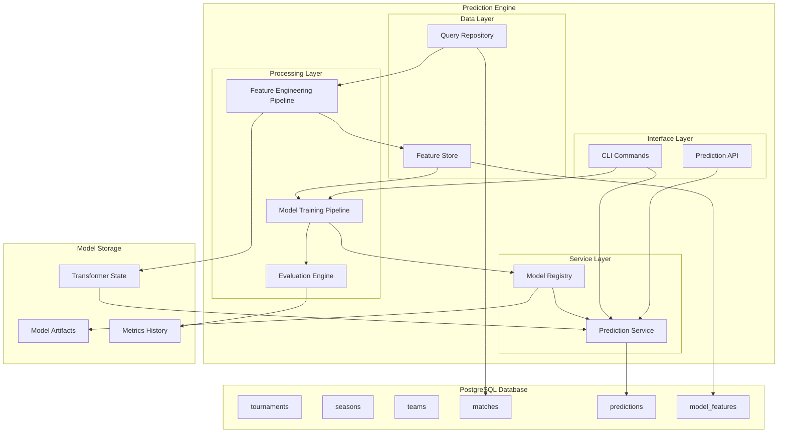
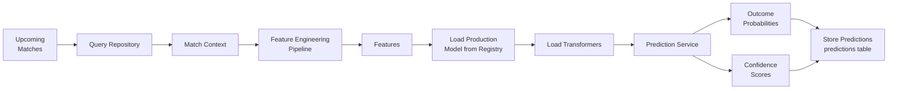
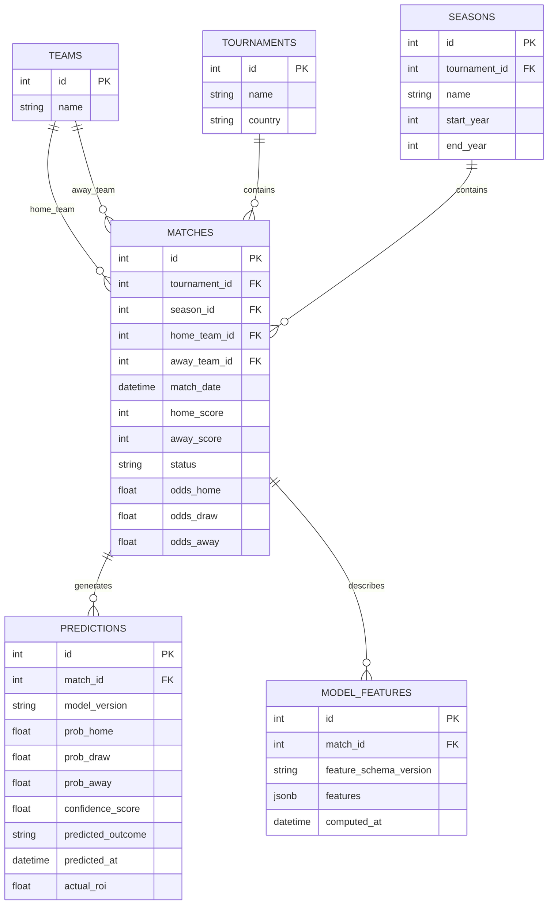

# AlgoBet Prediction Engine Architecture

## Executive Summary

This document defines the system architecture for a comprehensive football match prediction engine that integrates with the existing AlgoBet PostgreSQL database. The prediction engine will leverage historical match data, team statistics, and betting odds to generate match outcome predictions using machine learning models.

---

## Table of Contents

1. [Component Overview](#1-component-overview)
2. [Data Flow Diagram](#2-data-flow-diagram)
3. [Module Structure](#3-module-structure)
4. [Key Interfaces](#4-key-interfaces)
5. [Storage Strategy](#5-storage-strategy)
6. [CLI Integration](#6-cli-integration)
7. [Technology Stack](#7-technology-stack)

---

## 1. Component Overview

The prediction engine consists of six core components that work together to provide end-to-end prediction capabilities:

### 1.1 Component Diagram



### 1.2 Component Descriptions

#### 1.2.1 Feature Store
- **Purpose**: Centralized storage and retrieval of engineered features
- **Responsibilities**:
  - Cache computed features to avoid redundant calculations
  - Version feature schemas
  - Provide feature metadata and lineage tracking
  - Support time-travel queries for historical feature values

#### 1.2.2 Query Repository
- **Purpose**: Database abstraction layer for efficient data retrieval
- **Responsibilities**:
  - Query historical matches with filters (tournament, season, date range)
  - Retrieve team statistics and head-to-head records
  - Fetch betting odds history
  - Aggregate team performance metrics

#### 1.2.3 Feature Engineering Pipeline
- **Purpose**: Transform raw match data into ML-ready features
- **Responsibilities**:
  - Calculate team form (last N matches performance)
  - Compute head-to-head statistics
  - Generate betting odds features (implied probability, value indicators)
  - Create temporal features (day of week, rest days, etc.)
  - Handle feature scaling and encoding

#### 1.2.4 Model Training Pipeline
- **Purpose**: Train and validate prediction models
- **Responsibilities**:
  - Split data temporally (no data leakage)
  - Train multiple model types (classification for H/D/A outcomes)
  - Hyperparameter tuning
  - Cross-validation with time-series aware splits
  - Store trained models with metadata

#### 1.2.5 Model Registry
- **Purpose**: Manage model lifecycle and versioning
- **Responsibilities**:
  - Track model versions and their performance metrics
  - Support model promotion to production
  - Store model artifacts and configurations
  - Enable model rollback capabilities

#### 1.2.6 Prediction Service
- **Purpose**: Generate predictions for upcoming matches
- **Responsibilities**:
  - Load production models
  - Transform input data using saved transformers
  - Generate probability distributions for match outcomes
  - Calculate confidence scores and value bets
  - Store predictions with timestamps

#### 1.2.7 Evaluation Engine
- **Purpose**: Assess model performance and track prediction accuracy
- **Responsibilities**:
  - Calculate accuracy, precision, recall, F1, log loss
  - Track ROI for betting simulations
  - Generate calibration curves
  - Compare model versions
  - Produce performance reports

---

## 2. Data Flow Diagram

### 2.1 Training Pipeline Flow

```mermaid
flowchart LR
    A[PostgreSQL<br>matches table] --> B[Query Repository]
    B --> C[Raw Match Data]
    C --> D[Feature Engineering<br>Pipeline]
    D --> E[Engineered Features]
    E --> F[Feature Store<br>Cache & Version]
    F --> G[Temporal Split<br>Train/Validation/Test]
    G --> H[Model Training<br>Pipeline]
    H --> I[Trained Models]
    I --> J[Model Registry<br>Version & Metadata]
    J --> K[Evaluation Engine]
    K --> L[Performance Metrics]
    L --> M[Metrics History<br>Storage]
```



### 2.2 Prediction Pipeline Flow



### 2.3 Data Entities



---

## 3. Module Structure

### 3.1 Package Hierarchy

```
algobet/
├── __init__.py
├── cli.py                    # Existing CLI (extended)
├── database.py               # Existing DB module
├── models.py                 # Existing SQLAlchemy models
├── scraper.py                # Existing scraper
└── predictions/              # NEW: Prediction engine package
    ├── __init__.py
    ├── config.py             # Configuration settings
    ├── constants.py          # Enums and constants
    │
    ├── data/                 # Data access layer
    │   ├── __init__.py
    │   ├── repository.py     # Query repository
    │   └── queries.py        # SQL query definitions
    │
    ├── features/             # Feature engineering
    │   ├── __init__.py
    │   ├── pipeline.py       # Feature pipeline orchestrator
    │   ├── transformers.py   # Feature transformers
    │   ├── generators.py     # Feature generators
    │   ├── store.py          # Feature store
    │   └── schemas.py        # Feature schema definitions
    │
    ├── models/               # ML models
    │   ├── __init__.py
    │   ├── base.py           # Base model interface
    │   ├── classifiers.py    # Classification models
    │   ├── ensemble.py       # Ensemble methods
    │   └── registry.py       # Model registry
    │
    ├── training/             # Training pipeline
    │   ├── __init__.py
    │   ├── pipeline.py       # Training orchestrator
    │   ├── split.py          # Temporal data splitting
    │   └── tuner.py          # Hyperparameter tuning
    │
    ├── evaluation/           # Model evaluation
    │   ├── __init__.py
    │   ├── metrics.py        # Metric calculations
    │   ├── calibration.py    # Calibration analysis
    │   └── reports.py        # Report generation
    │
    ├── service/              # Prediction service
    │   ├── __init__.py
    │   ├── predictor.py      # Main prediction interface
    │   ├── batch.py          # Batch prediction handler
    │   └── value.py          # Value bet detection
    │
    └── cli/                  # Prediction CLI commands
        ├── __init__.py
        ├── train.py          # Training commands
        ├── predict.py        # Prediction commands
        └── evaluate.py       # Evaluation commands
```

### 3.2 File Organization Details

| Path | Purpose |
|------|---------|
| `algobet/predictions/__init__.py` | Package initialization, expose main interfaces |
| `algobet/predictions/config.py` | Configuration classes using Pydantic/BaseSettings |
| `algobet/predictions/constants.py` | Enums for outcomes, model types, feature types |
| `algobet/predictions/data/repository.py` | SQLAlchemy-based data access with query building |
| `algobet/predictions/features/pipeline.py` | Scikit-learn Pipeline-compatible transformers |
| `algobet/predictions/models/base.py` | Abstract base class for all models |
| `algobet/predictions/models/classifiers.py` | XGBoost, LightGBM, RandomForest implementations |
| `algobet/predictions/models/registry.py` | MLflow-style model versioning |
| `algobet/predictions/training/pipeline.py` | End-to-end training workflow |
| `algobet/predictions/service/predictor.py` | Main API for generating predictions |
| `algobet/predictions/cli/*.py` | Click command extensions |

---

## 4. Key Interfaces

### 4.1 Feature Engineering Interface

```python
# algobet/predictions/features/pipeline.py

from abc import ABC, abstractmethod
from dataclasses import dataclass
from datetime import datetime
from typing import Any, Protocol, TypeVar

import pandas as pd
from sklearn.base import BaseEstimator, TransformerMixin


T = TypeVar('T')


class FeatureSchema:
    """Defines the schema for a set of features."""

    def __init__(self, version: str, features: dict[str, type]) -> None:
        self.version = version
        self.features = features

    def validate(self, df: pd.DataFrame) -> bool:
        """Validate that dataframe conforms to schema."""
        ...


class FeatureGenerator(ABC):
    """Abstract base for feature generators."""

    @abstractmethod
    def generate(self, match_data: pd.DataFrame) -> pd.DataFrame:
        """Generate features from match data.

        Args:
            match_data: DataFrame with raw match records

        Returns:
            DataFrame with additional feature columns
        """
        ...

    @property
    @abstractmethod
    def feature_names(self) -> list[str]:
        """Return list of feature names generated by this generator."""
        ...


class TeamFormGenerator(FeatureGenerator):
    """Generate team form features."""

    def __init__(self, window_sizes: list[int] = [3, 5, 10]) -> None:
        self.window_sizes = window_sizes

    def generate(self, match_data: pd.DataFrame) -> pd.DataFrame:
        ...

    @property
    def feature_names(self) -> list[str]:
        return [f"home_form_{w}" for w in self.window_sizes] + \
               [f"away_form_{w}" for w in self.window_sizes]


class FeaturePipeline:
    """Orchestrates feature generation and transformation."""

    def __init__(
        self,
        generators: list[FeatureGenerator],
        transformers: list[tuple[str, BaseEstimator]],
        schema: FeatureSchema
    ) -> None:
        self.generators = generators
        self.transformers = transformers
        self.schema = schema
        self._pipeline: TransformerMixin | None = None

    def fit_transform(
        self,
        match_data: pd.DataFrame,
        fit: bool = True
    ) -> tuple[pd.DataFrame, FeatureSchema]:
        """Generate and transform features.

        Args:
            match_data: Raw match data
            fit: Whether to fit transformers or use existing

        Returns:
            Tuple of (transformed features, feature schema)
        """
        ...

    def transform(self, match_data: pd.DataFrame) -> pd.DataFrame:
        """Transform new data using fitted pipeline."""
        ...

    def save(self, path: str) -> None:
        """Save pipeline state including fitted transformers."""
        ...

    @classmethod
    def load(cls, path: str) -> FeaturePipeline:
        """Load pipeline with fitted transformers."""
        ...
```

### 4.2 Model Training Interface

```python
# algobet/predictions/models/base.py
# algobet/predictions/training/pipeline.py

from abc import ABC, abstractmethod
from dataclasses import dataclass
from datetime import datetime
from enum import Enum
from pathlib import Path
from typing import Any, Literal, Protocol

import pandas as pd
import numpy as np
from numpy.typing import NDArray


Outcome = Literal['H', 'D', 'A']


@dataclass
class TrainingConfig:
    """Configuration for model training."""
    model_type: str
    hyperparameters: dict[str, Any]
    validation_split: float = 0.2
    test_split: float = 0.1
    random_seed: int = 42
    target_column: str = 'result'
    feature_schema_version: str = 'v1.0'


@dataclass
class TrainingResult:
    """Result of a training run."""
    model_id: str
    model_version: str
    metrics: dict[str, float]
    feature_importance: dict[str, float]
    training_duration_seconds: float
    trained_at: datetime
    config: TrainingConfig
    artifact_path: Path


class MatchPredictor(ABC):
    """Abstract base class for match prediction models."""

    @abstractmethod
    def fit(
        self,
        X: pd.DataFrame | NDArray[np.float64],
        y: pd.Series | NDArray[np.str_]
    ) -> None:
        """Train the model on feature data."""
        ...

    @abstractmethod
    def predict(self, X: pd.DataFrame | NDArray[np.float64]) -> list[Outcome]:
        """Predict match outcomes."""
        ...

    @abstractmethod
    def predict_proba(
        self,
        X: pd.DataFrame | NDArray[np.float64]
    ) -> NDArray[np.float64]:
        """Predict outcome probabilities.

        Returns:
            Array of shape (n_samples, 3) with probabilities
            for [Home Win, Draw, Away Win]
        """
        ...

    @abstractmethod
    def save(self, path: Path) -> None:
        """Save model to disk."""
        ...

    @classmethod
    @abstractmethod
    def load(cls, path: Path) -> MatchPredictor:
        """Load model from disk."""
        ...

    @property
    @abstractmethod
    def feature_importance(self) -> dict[str, float] | None:
        """Return feature importance if available."""
        ...


class TrainingPipeline:
    """End-to-end training pipeline."""

    def __init__(
        self,
        config: TrainingConfig,
        feature_pipeline: FeaturePipeline,
        model_registry: ModelRegistry
    ) -> None:
        self.config = config
        self.feature_pipeline = feature_pipeline
        self.model_registry = model_registry

    def run(
        self,
        match_data: pd.DataFrame,
        tournament_filter: list[str] | None = None,
        date_range: tuple[datetime, datetime] | None = None
    ) -> TrainingResult:
        """Execute full training pipeline.

        Args:
            match_data: Historical match records
            tournament_filter: Optional list of tournaments to include
            date_range: Optional (start_date, end_date) filter

        Returns:
            TrainingResult with model and metadata
        """
        ...

    def _split_data(
        self,
        df: pd.DataFrame
    ) -> tuple[pd.DataFrame, pd.DataFrame, pd.DataFrame]:
        """Temporally split data into train/val/test."""
        ...
```

### 4.3 Prediction Interface

```python
# algobet/predictions/service/predictor.py

from dataclasses import dataclass
from datetime import datetime
from typing import Callable

import pandas as pd
from numpy.typing import NDArray


@dataclass(frozen=True)
class MatchPrediction:
    """A single match prediction."""
    match_id: int
    home_team: str
    away_team: str
    match_date: datetime

    # Probabilities
    prob_home_win: float
    prob_draw: float
    prob_away_win: float

    # Derived values
    predicted_outcome: str  # 'H', 'D', or 'A'
    confidence_score: float  # 0.0 to 1.0
    entropy: float  # Uncertainty measure

    # Model info
    model_version: str
    feature_schema_version: str
    predicted_at: datetime

    @property
    def max_probability(self) -> float:
        """Return highest probability."""
        return max(self.prob_home_win, self.prob_draw, self.prob_away_win)

    def get_value_bet(self, odds_home: float, odds_draw: float, odds_away: float) -> ValueBet | None:
        """Identify if there's a value betting opportunity."""
        ...


@dataclass(frozen=True)
class ValueBet:
    """Identified value betting opportunity."""
    match_id: int
    outcome: str  # 'H', 'D', or 'A'
    predicted_probability: float
    market_odds: float
    expected_value: float
    kelly_fraction: float


class PredictionService:
    """Main service for generating predictions."""

    def __init__(
        self,
        model_registry: ModelRegistry,
        feature_pipeline: FeaturePipeline,
        default_model_version: str | None = None
    ) -> None:
        self.model_registry = model_registry
        self.feature_pipeline = feature_pipeline
        self.default_model_version = default_model_version
        self._loaded_models: dict[str, MatchPredictor] = {}

    def predict_match(
        self,
        match_id: int,
        model_version: str | None = None
    ) -> MatchPrediction:
        """Generate prediction for a single match.

        Args:
            match_id: Database ID of the match
            model_version: Specific model version, or None for default

        Returns:
            MatchPrediction with probabilities and metadata
        """
        ...

    def predict_upcoming(
        self,
        tournament: str | None = None,
        days_ahead: int = 7,
        model_version: str | None = None,
        min_confidence: float = 0.0
    ) -> list[MatchPrediction]:
        """Generate predictions for all upcoming matches.

        Args:
            tournament: Filter by tournament name
            days_ahead: Number of days to look ahead
            model_version: Specific model version
            min_confidence: Minimum confidence threshold

        Returns:
            List of MatchPrediction objects
        """
        ...

    def predict_batch(
        self,
        match_ids: list[int],
        model_version: str | None = None
    ) -> list[MatchPrediction]:
        """Generate predictions for multiple matches efficiently."""
        ...

    def get_value_bets(
        self,
        min_ev: float = 0.05,
        max_matches: int = 10,
        model_version: str | None = None
    ) -> list[ValueBet]:
        """Identify value betting opportunities.

        Args:
            min_ev: Minimum expected value threshold
            max_matches: Maximum number of matches to return
            model_version: Specific model version

        Returns:
            List of ValueBet opportunities sorted by EV
        """
        ...

    def _load_model(self, version: str) -> MatchPredictor:
        """Load and cache a model version."""
        ...
```

### 4.4 Model Evaluation Interface

```python
# algobet/predictions/evaluation/metrics.py
# algobet/predictions/evaluation/reports.py

from dataclasses import dataclass
from datetime import datetime
from pathlib import Path
from typing import Callable

import pandas as pd
from numpy.typing import NDArray
import numpy as np


@dataclass
class EvaluationMetrics:
    """Standard evaluation metrics for match prediction."""

    # Classification metrics
    accuracy: float
    precision_macro: float
    recall_macro: float
    f1_macro: float
    precision_weighted: float
    recall_weighted: float
    f1_weighted: float

    # Prediction-specific metrics
    log_loss: float
    brier_score: float
    top_1_accuracy: float
    top_2_accuracy: float

    # Calibration metrics
    expected_calibration_error: float
    maximum_calibration_error: float

    # Betting simulation metrics
    total_bets: int
    winning_bets: int
    roi_percent: float
    profit_loss: float
    sharpe_ratio: float
    max_drawdown: float

    # Per-outcome breakdown
    outcome_accuracy: dict[str, float]  # {'H': 0.5, 'D': 0.3, 'A': 0.6}
    outcome_precision: dict[str, float]
    outcome_recall: dict[str, float]


@dataclass
class EvaluationReport:
    """Complete evaluation report."""

    model_id: str
    model_version: str
    evaluated_at: datetime

    # Data info
    num_samples: int
    date_range: tuple[datetime, datetime]
    tournaments: list[str]

    # Metrics
    metrics: EvaluationMetrics

    # Additional data
    confusion_matrix: NDArray[np.float64]
    calibration_data: pd.DataFrame
    feature_importance: dict[str, float] | None

    def to_html(self, output_path: Path) -> None:
        """Generate HTML report."""
        ...

    def to_markdown(self) -> str:
        """Generate markdown summary."""
        ...


class EvaluationEngine:
    """Engine for comprehensive model evaluation."""

    def __init__(
        self,
        betting_strategy: Callable[[MatchPrediction], float] | None = None
    ) -> None:
        """
        Args:
            betting_strategy: Function that returns stake amount given prediction
        """
        self.betting_strategy = betting_strategy or self._default_strategy

    def evaluate(
        self,
        predictions: list[MatchPrediction],
        actual_results: pd.Series,
        odds_data: pd.DataFrame | None = None
    ) -> EvaluationMetrics:
        """Calculate evaluation metrics.

        Args:
            predictions: List of predictions
            actual_results: Series of actual outcomes ('H', 'D', 'A')
            odds_data: Optional DataFrame with odds for betting simulation

        Returns:
            EvaluationMetrics with all calculated metrics
        """
        ...

    def generate_report(
        self,
        model: MatchPredictor,
        test_data: pd.DataFrame,
        feature_pipeline: FeaturePipeline
    ) -> EvaluationReport:
        """Generate comprehensive evaluation report."""
        ...

    def compare_models(
        self,
        reports: list[EvaluationReport]
    ) -> pd.DataFrame:
        """Compare multiple model versions."""
        ...

    def _default_strategy(self, prediction: MatchPrediction) -> float:
        """Default flat betting strategy."""
        return 1.0
```

### 4.5 Model Registry Interface

```python
# algobet/predictions/models/registry.py

from dataclasses import dataclass
from datetime import datetime
from pathlib import Path
from typing import Iterator


@dataclass
class ModelMetadata:
    """Metadata for a registered model."""
    model_id: str
    version: str
    model_type: str
    created_at: datetime
    metrics: dict[str, float]
    feature_schema_version: str
    artifact_path: Path
    is_production: bool
    tags: dict[str, str]
    description: str | None


class ModelRegistry:
    """Registry for managing model versions."""

    def __init__(self, storage_path: Path) -> None:
        self.storage_path = storage_path

    def register(
        self,
        model: MatchPredictor,
        metadata: ModelMetadata
    ) -> str:
        """Register a new model version.

        Returns:
            Model version string
        """
        ...

    def get(self, version: str) -> tuple[MatchPredictor, ModelMetadata]:
        """Load a specific model version."""
        ...

    def get_production(self) -> tuple[MatchPredictor, ModelMetadata]:
        """Load the current production model."""
        ...

    def promote_to_production(self, version: str) -> None:
        """Promote a model version to production."""
        ...

    def list_versions(
        self,
        model_type: str | None = None
    ) -> Iterator[ModelMetadata]:
        """List all registered model versions."""
        ...

    def delete_version(self, version: str) -> None:
        """Delete a specific model version."""
        ...

    def get_model_history(
        self,
        model_type: str
    ) -> list[ModelMetadata]:
        """Get chronological history of a model type."""
        ...
```

---

## 5. Storage Strategy

### 5.1 Storage Locations

| Data Type | Storage | Format | Path |
|-----------|---------|--------|------|
| Trained Models | Local Filesystem | Joblib/Pickle | `data/models/{model_type}/{version}/` |
| Feature Transformers | Local Filesystem | Joblib | `data/models/{model_type}/{version}/transformers/` |
| Model Metadata | SQLite | JSON | `data/models/registry.db` |
| Feature Cache | PostgreSQL | JSONB | `model_features` table |
| Predictions | PostgreSQL | Structured | `predictions` table |
| Metrics History | Local Filesystem | Parquet | `data/metrics/` |
| Evaluation Reports | Local Filesystem | HTML/Markdown | `data/reports/` |

### 5.2 Model Artifact Structure

```
data/
└── models/
    ├── registry.db                    # SQLite metadata database
    │
    ├── xgboost/
    │   ├── v1.0.0_20240115_143022/
    │   │   ├── model.joblib          # Trained model
    │   │   ├── transformers/
    │   │   │   ├── scaler.joblib
    │   │   │   └── encoder.joblib
    │   │   ├── metadata.json         # ModelMetadata as JSON
    │   │   └── training_config.yaml  # TrainingConfig
    │   │
    │   ├── v1.1.0_20240201_092145/
    │   │   ├── model.joblib
    │   │   └── ...
    │   │
    │   └── production -> v1.1.0_20240201_092145/  # Symlink
    │
    ├── random_forest/
    │   └── ...
    │
    └── ensemble/
        └── ...
```

### 5.3 Database Schema Extensions

```sql
-- New table for storing predictions
CREATE TABLE predictions (
    id SERIAL PRIMARY KEY,
    match_id INTEGER NOT NULL REFERENCES matches(id) ON DELETE CASCADE,
    model_version VARCHAR(50) NOT NULL,
    prob_home_win DECIMAL(5,4) NOT NULL CHECK (prob_home_win >= 0 AND prob_home_win <= 1),
    prob_draw DECIMAL(5,4) NOT NULL CHECK (prob_draw >= 0 AND prob_draw <= 1),
    prob_away_win DECIMAL(5,4) NOT NULL CHECK (prob_away_win >= 0 AND prob_away_win <= 1),
    predicted_outcome CHAR(1) NOT NULL CHECK (predicted_outcome IN ('H', 'D', 'A')),
    confidence_score DECIMAL(5,4) NOT NULL,
    predicted_at TIMESTAMP NOT NULL DEFAULT NOW(),
    actual_roi DECIMAL(10,2),

    UNIQUE(match_id, model_version)
);

CREATE INDEX idx_predictions_match ON predictions(match_id);
CREATE INDEX idx_predictions_model ON predictions(model_version);
CREATE INDEX idx_predictions_date ON predictions(predicted_at);

-- New table for caching computed features
CREATE TABLE model_features (
    id SERIAL PRIMARY KEY,
    match_id INTEGER NOT NULL REFERENCES matches(id) ON DELETE CASCADE,
    feature_schema_version VARCHAR(20) NOT NULL,
    features JSONB NOT NULL,
    computed_at TIMESTAMP NOT NULL DEFAULT NOW(),

    UNIQUE(match_id, feature_schema_version)
);

CREATE INDEX idx_features_match ON model_features(match_id);
CREATE INDEX idx_features_schema ON model_features(feature_schema_version);
```

### 5.4 Caching Strategy

| Cache Level | Strategy | TTL |
|-------------|----------|-----|
| Feature Store | Computed features cached in PostgreSQL | Permanent (until schema change) |
| Model Cache | Models loaded in memory on first use | Application lifetime |
| Prediction Cache | Recent predictions cached | 1 hour |
| Data Cache | Query results for team stats | 5 minutes |

---

## 6. CLI Integration

### 6.1 Command Structure

The prediction engine extends the existing Click CLI with new command groups:

```
algobet
├── init                    # Existing: Initialize database
├── scrape                  # Existing: Scrape historical matches
├── scrape-all              # Existing: Scrape multiple seasons
├── scrape-upcoming         # Existing: Scrape upcoming matches
├── seasons                 # Existing: List seasons
├── export                  # Existing: Export to CSV
│
├── predictions             # NEW: Prediction commands
│   ├── train               # Train models
│   ├── list-models         # List registered models
│   ├── promote             # Promote model to production
│   ├── predict             # Generate predictions
│   ├── upcoming            # Predict upcoming matches
│   ├── value-bets          # Find value betting opportunities
│   ├── evaluate            # Evaluate model performance
│   └── backtest            # Run backtesting simulation
│
└── features                # NEW: Feature management
    ├── generate            # Generate features for matches
    ├── validate            # Validate feature schema
    └── inspect             # Inspect feature statistics
```

### 6.2 CLI Command Specifications

```python
# algobet/predictions/cli/train.py

import click
from algobet.predictions.training.pipeline import TrainingPipeline
from algobet.predictions.config import load_config


@click.group(name='predictions')
def predictions_cli():
    """Match prediction and model management commands."""
    pass


@predictions_cli.command()
@click.option('--model-type', default='xgboost',
              type=click.Choice(['xgboost', 'lightgbm', 'random_forest', 'ensemble']))
@click.option('--tournament', multiple=True, help='Tournaments to include')
@click.option('--from-date', type=click.DateTime(), help='Start date for training data')
@click.option('--to-date', type=click.DateTime(), help='End date for training data')
@click.option('--config', type=click.Path(), help='Path to training config YAML')
@click.option('--name', help='Model name/description')
def train(
    model_type: str,
    tournament: tuple[str, ...],
    from_date: datetime | None,
    to_date: datetime | None,
    config: str | None,
    name: str | None
):
    """Train a new prediction model.

    Examples:
        algobet predictions train --model-type xgboost
        algobet predictions train --tournament "Premier League" --from-date 2020-01-01
    """
    ...


@predictions_cli.command('list-models')
@click.option('--model-type', help='Filter by model type')
@click.option('--limit', default=20, help='Maximum models to show')
def list_models(model_type: str | None, limit: int):
    """List all registered model versions."""
    ...


@predictions_cli.command()
@click.argument('version')
def promote(version: str):
    """Promote a model version to production."""
    ...


@predictions_cli.command()
@click.option('--match-id', type=int, multiple=True, help='Specific match IDs')
@click.option('--tournament', help='Predict all matches in tournament')
@click.option('--days', default=7, help='Days ahead to predict')
@click.option('--model-version', help='Specific model version')
@click.option('--output', type=click.Path(), help='Output file for predictions')
@click.option('--format', 'output_format', default='table',
              type=click.Choice(['table', 'json', 'csv']))
def predict(
    match_id: tuple[int, ...],
    tournament: str | None,
    days: int,
    model_version: str | None,
    output: str | None,
    output_format: str
):
    """Generate predictions for matches.

    Examples:
        algobet predictions predict --match-id 12345
        algobet predictions predict --tournament "Premier League" --days 3
    """
    ...


@predictions_cli.command('value-bets')
@click.option('--min-ev', default=0.05, help='Minimum expected value threshold')
@click.option('--max-odds', default=10.0, help='Maximum odds to consider')
@click.option('--days', default=7, help='Days ahead to search')
@click.option('--model-version', help='Specific model version')
@click.option('--stake', default=100.0, help='Simulated stake amount')
def value_bets(
    min_ev: float,
    max_odds: float,
    days: int,
    model_version: str | None,
    stake: float
):
    """Find value betting opportunities.

    Identifies bets where predicted probability * odds > 1 + min_ev
    """
    ...


@predictions_cli.command()
@click.option('--model-version', help='Model version to evaluate')
@click.option('--from-date', type=click.DateTime())
@click.option('--to-date', type=click.DateTime())
@click.option('--tournament', multiple=True)
@click.option('--output', type=click.Path(), help='Report output path')
@click.option('--format', 'output_format', default='markdown',
              type=click.Choice(['markdown', 'html', 'json']))
def evaluate(
    model_version: str | None,
    from_date: datetime | None,
    to_date: datetime | None,
    tournament: tuple[str, ...],
    output: str | None,
    output_format: str
):
    """Evaluate model performance on historical data."""
    ...


@predictions_cli.command()
@click.option('--model-version', help='Model version to backtest')
@click.option('--from-date', type=click.DateTime())
@click.option('--to-date', type=click.DateTime())
@click.option('--bankroll', default=1000.0, help='Starting bankroll')
@click.option('--stake-strategy', default='flat',
              type=click.Choice(['flat', 'kelly', 'confidence']))
def backtest(
    model_version: str | None,
    from_date: datetime | None,
    to_date: datetime | None,
    bankroll: float,
    stake_strategy: str
):
    """Run backtesting simulation with betting strategy."""
    ...
```

### 6.3 CLI Integration Point

```python
# algobet/cli.py - Integration with existing CLI

import click
from .predictions.cli.train import predictions_cli

def cli():
    """AlgoBet - Football match database and prediction engine."""
    pass

# Add existing commands...
cli.add_command(init)
cli.add_command(scrape)
# ... etc

# Add prediction commands
cli.add_command(predictions_cli)
```

---

## 7. Technology Stack

### 7.1 Core Dependencies

| Category | Library | Purpose |
|----------|---------|---------|
| ML Framework | scikit-learn | Base ML utilities, preprocessing |
| Gradient Boosting | xgboost, lightgbm | Primary classification models |
| Data Processing | pandas, numpy | Data manipulation |
| Database | SQLAlchemy 2.0, psycopg2 | ORM and PostgreSQL driver |
| CLI | click | Command-line interface |
| Configuration | pydantic | Settings management |
| Serialization | joblib | Model serialization |
| Metrics | scikit-learn.metrics | Evaluation metrics |

### 7.2 Optional Dependencies

| Category | Library | Purpose |
|----------|---------|---------|
| Hyperparameter Tuning | optuna | Bayesian optimization |
| Feature Selection | sklearn.feature_selection | RFE, mutual info |
| Calibration | sklearn.calibration | Probability calibration |
| Visualization | matplotlib, seaborn | Report generation |
| Experiment Tracking | mlflow | Alternative to custom registry |

### 7.3 Configuration

```python
# algobet/predictions/config.py

from pathlib import Path
from pydantic import BaseSettings, Field


class PredictionConfig(BaseSettings):
    """Configuration for prediction engine."""

    # Paths
    models_dir: Path = Field(default=Path("data/models"))
    reports_dir: Path = Field(default=Path("data/reports"))
    metrics_dir: Path = Field(default=Path("data/metrics"))

    # Model defaults
    default_model_type: str = "xgboost"
    default_model_version: str | None = None

    # Training defaults
    default_test_split: float = 0.1
    default_val_split: float = 0.2
    random_seed: int = 42

    # Feature engineering
    form_window_sizes: list[int] = [3, 5, 10]
    max_h2h_matches: int = 10

    # Prediction thresholds
    min_confidence: float = 0.0
    min_ev_threshold: float = 0.05

    # Caching
    feature_cache_ttl: int = 86400  # 24 hours
    prediction_cache_ttl: int = 3600  # 1 hour

    class Config:
        env_prefix = "ALGOBET_PRED_"
```

---

## Appendix A: Database Migration Script

```sql
-- migrations/002_add_predictions_tables.sql

-- Enable UUID extension for model IDs
CREATE EXTENSION IF NOT EXISTS "uuid-ossp";

-- Predictions table
CREATE TABLE IF NOT EXISTS predictions (
    id SERIAL PRIMARY KEY,
    match_id INTEGER NOT NULL REFERENCES matches(id) ON DELETE CASCADE,
    model_version VARCHAR(50) NOT NULL,
    prob_home_win DECIMAL(5,4) NOT NULL CHECK (prob_home_win >= 0 AND prob_home_win <= 1),
    prob_draw DECIMAL(5,4) NOT NULL CHECK (prob_draw >= 0 AND prob_draw <= 1),
    prob_away_win DECIMAL(5,4) NOT NULL CHECK (prob_away_win >= 0 AND prob_away_win <= 1),
    predicted_outcome CHAR(1) NOT NULL CHECK (predicted_outcome IN ('H', 'D', 'A')),
    confidence_score DECIMAL(5,4) NOT NULL,
    predicted_at TIMESTAMP NOT NULL DEFAULT NOW(),
    actual_roi DECIMAL(10,2),

    CONSTRAINT uq_prediction_match_model UNIQUE (match_id, model_version)
);

CREATE INDEX IF NOT EXISTS idx_predictions_match ON predictions(match_id);
CREATE INDEX IF NOT EXISTS idx_predictions_model ON predictions(model_version);
CREATE INDEX IF NOT EXISTS idx_predictions_date ON predictions(predicted_at);

-- Model features cache table
CREATE TABLE IF NOT EXISTS model_features (
    id SERIAL PRIMARY KEY,
    match_id INTEGER NOT NULL REFERENCES matches(id) ON DELETE CASCADE,
    feature_schema_version VARCHAR(20) NOT NULL,
    features JSONB NOT NULL,
    computed_at TIMESTAMP NOT NULL DEFAULT NOW(),

    CONSTRAINT uq_features_match_schema UNIQUE (match_id, feature_schema_version)
);

CREATE INDEX IF NOT EXISTS idx_features_match ON model_features(match_id);
CREATE INDEX IF NOT EXISTS idx_features_schema ON model_features(feature_schema_version);

-- Add GIN index for JSONB queries
CREATE INDEX IF NOT EXISTS idx_features_gin ON model_features USING GIN (features);
```

---

## Appendix B: Example Usage Flow

```bash
# 1. Initialize database (existing command)
algobet init

# 2. Scrape historical data (existing command)
algobet scrape-all --url "..." --from-season "2020/2021"

# 3. Train a model
algobet predictions train --model-type xgboost --tournament "Premier League"
# Output: Model v1.0.0_20240115_143022 trained successfully

# 4. Evaluate the model
algobet predictions evaluate --model-version v1.0.0_20240115_143022

# 5. Promote to production
algobet predictions promote v1.0.0_20240115_143022

# 6. Scrape upcoming matches (existing command)
algobet scrape-upcoming

# 7. Generate predictions
algobet predictions predict --days 7 --format table

# 8. Find value bets
algobet predictions value-bets --min-ev 0.1 --days 3

# 9. Run backtest
algobet predictions backtest --from-date 2023-01-01 --to-date 2023-12-31
```

---

*Document Version: 1.0*
*Last Updated: 2026-01-31*
